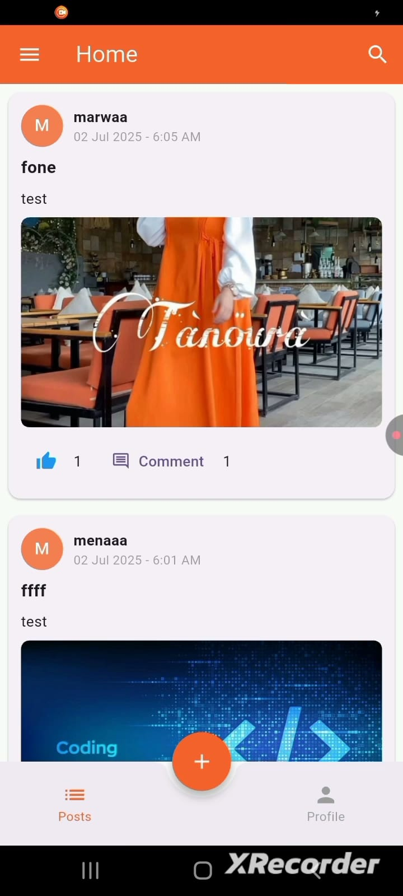
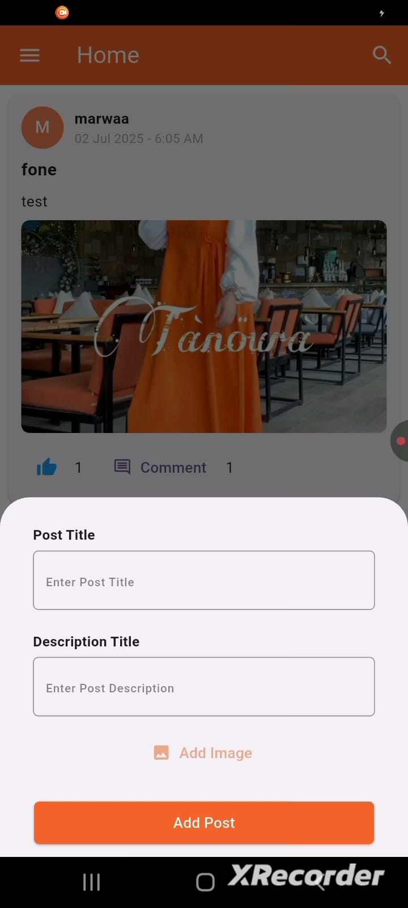
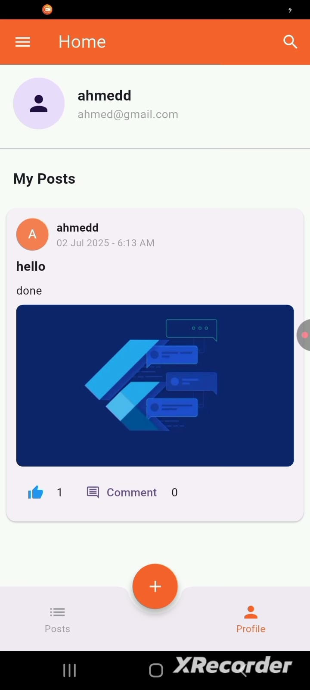
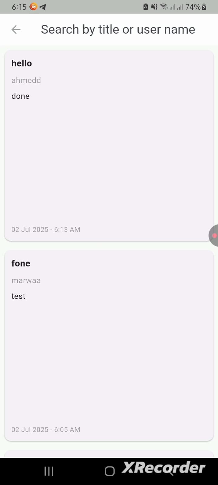
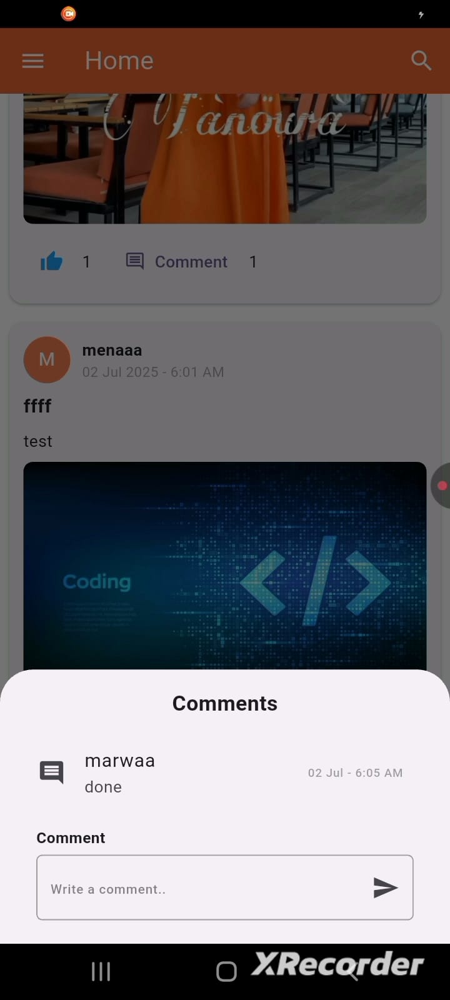

# Social Media App

A Flutter-based social media application that allows users to create posts, upload images, interact with other users through likes and comments, and manage authentication using Firebase.

---

## ✨ Features

- User Authentication
- User Registration
- Social Feed
- Create Posts
- Upload Images
- Search Posts by Title
- Search Users by Username
- Like Posts with Like Counter
- Comment on Posts
- User Profile
- Logout
- Firebase Cloud Firestore Integration
- Persistent User Session

---

## 🛠 Tech Stack

- Flutter
- Dart
- Firebase Authentication
- Cloud Firestore
- Image Picker
- Shared Preferences
- flutter_dotenv

---

## 📂 Project Structure

```
lib
├── helper
├── services
├── utils
├── views
├── widgets
└── main.dart
```

---

## 📸 Screenshots

| Home Feed | Create Post |
|-----------|-------------|
|  |  |

| Profile | Search |
|---------|--------|
|  |  |

| Comments |
|----------|
|  |

---

## 🎥 Demo Video

Watch the demo here:

https://youtube.com/shorts/1PdEvM982HQ?feature=share

---

## 📚 What I Learned

- Integrating Firebase Authentication with Flutter.
- Managing application data using Cloud Firestore.
- Uploading and displaying images.
- Building a social feed with likes and comments.
- Implementing search functionality for users and posts.
- Managing user sessions using Shared Preferences.
- Securing configuration values using flutter_dotenv.

---

## 🚀 Getting Started

```bash
flutter pub get
flutter run
```

---
